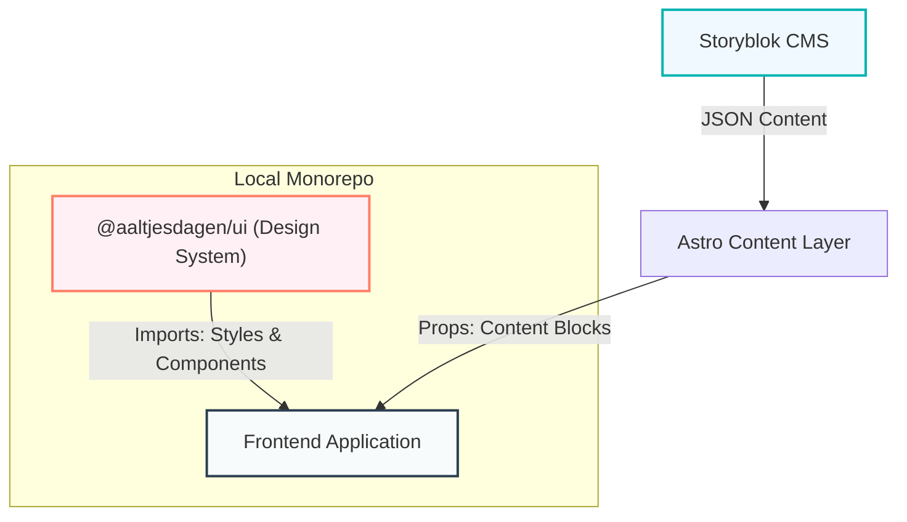

# Development Guide

> **Project**: Aaltjesdagen Frontend & Design System
> **Workflow**: Monorepo-style with Local Package

This guide covers the development workflow, explaining how to work with both the core application and the unified design system package.


---

## 🏗️ Architecture Visualization

The project follows a monitored data flow between the CMS, the Design System, and the Application.



---

## 🚀 Workflows


### 1. Starting Development

The project is configured as a monorepo. Installing dependencies in the root also links the local workspaces.

```bash
# Install and Link
npm install

# Start Development Server (Hot Reload)
npm run dev
```
> **Note**: `npm run dev` watches both the frontend app and the `packages/design-system` files. Changes to the design system (CSS/Astro) will HMR automatically.

### 2. Working with the Design System

The UI logic lives in `packages/design-system`.

- **Making CSS Changes**:
  - Edit `packages/design-system/src/styles/theme.css` for variables.
  - Edit `packages/design-system/tailwind-plugin.js` for utility classes (`.btn`, `.card-base`).
  - *Tip: The tailwind configuration is set to watch these files. However, if changes aren't picked up, restart the dev server.*

- **Creating a New UI Component**:
  1. Create `packages/design-system/src/components/MyComponent.astro`.
  2. Export it from `packages/design-system/src/components/index.ts`.
  3. Import in the app: `import { MyComponent } from "@aaltjesdagen/ui/components";`

### 3. Storyblok Integration

**Visual Editor**:
The development server runs on HTTPS (via `mkcert` or similar if configured, or HTTP with proxy) to support Storyblok's Visual Editor. Ensure your `.env` contains a valid `STORYBLOK_TOKEN`.

**Component Mapping**:
When adding a new content block for the CMS:
1. Create the component in `src/storyblok/sections/` (or `ui/`, `features/` etc).
2. Register it in `astro.config.mjs` under `storyblok.components`.
3. Ensure it uses `storyblokEditable(blok)` on the root element.

### 4. Component State (Alpine.js)

We use **Alpine.js** for client-side interactivity ("Islands of Interactivity").

- **Scope**: Keep interaction local (modals, mobile menu, form validation).
- **Communication**: Use standard DOM events (`@click`, `@custom-event.window`) to communicate between components.
- **Performance**: Alpine is lightweight. Avoid heavy logic; delegate calculation to the build step.

---


## 🛠️ Build & Deployment

### Production Build
```bash
npm run build
```
This generates a static site in `dist/`.

### Deployment (Vercel)
The project is optimized for Vercel.
- **Build Command**: `npm run build`
- **Output Directory**: `dist`
- **Framework Preset**: Astro

> **Important**: `inlineStylesheets` is set to `'never'` in Astro config to prevent specific CSS gradient text bugs in production.

---

## ✅ Best Practices

1. **Imports**: Always import UI elements from the package alias (`@aaltjesdagen/ui/...`) rather than relative paths.
2. **Utilities**: Use `storyblokImage` from the package for optimized image delivery.
3. **Icons**: Use the `Icon` component or inline SVGs for performance; avoid heavy icon libraries.
4. **Dates**: Use the `formatDate` utility to ensure Dutch locale consistency.

---

## 🧪 Testing & Quality Assurance

This project maintains professional quality standards with comprehensive testing.

**Quick Commands**:
```bash
npm test           # Run all tests (unit + E2E)
npm run test:unit  # Unit tests only (Vitest)
npm run test:e2e   # E2E tests only (Playwright)
npm run test:ci    # CI-optimized (Chromium only)
```

**Test Coverage**:
- **26 unit tests**: Logger, Performance Monitor, Date Utilities
- **30+ E2E tests**: Navigation, Legal Pages, Accessibility
- **WCAG AA Compliant**: Automated accessibility checks

**CI/CD**:
- ✅ Automated testing on every push (GitHub Actions)
- ✅ Type checking with `astro check`
- ✅ Weekly accessibility audits
- ✅ Test artifacts uploaded for review

**📚 Full Documentation**: See [TESTING.md](./TESTING.md) for complete guide.

---

---

## 📊 Analytics

The project uses a professional Vercel Analytics setup.

- **Web Analytics**: Tracks page views and visitors.
- **Speed Insights**: Tracks Core Web Vitals (Real Experience).

**Configuration**:
Analytics are configured in `astro.config.mjs` via the Vercel adapter.
*Note: Dashboard activation is required on Vercel for data collection.*

---

## 📚 Advanced References

- **[Infrastructure & Logging](./reference/INFRASTRUCTURE.md)**: Logging system, Performance Monitoring, and Service Layer patterns.

---

**Last Updated**: January 1, 2026
