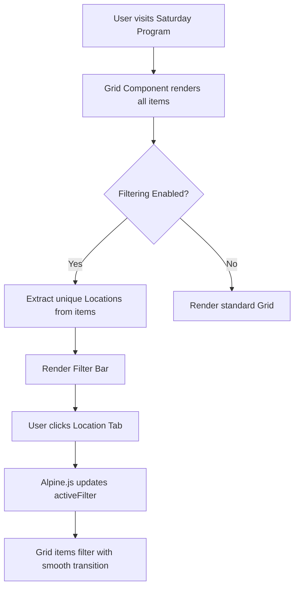

# Technical Specification: High-Density Program Layout

## 1. Objective
Design and implement a high-density layout strategy for the Saturday program (18+ events) to ensure a premium user experience with minimal scrolling and intuitive navigation.

## 2. Proposed Solution: Location-Based Filtering
Instead of a single long list, we will implement a dynamic filtering system that allows users to view events by location.

### 2.1 Storyblok Schema Updates
#### Feature Component (`visual/Feature.astro`)
- **New Field: `location`**
  - Type: `text` or `single option`
  - Options: `Markt`, `Haven`, `Binnenstad`, `Visafslag`, `Plantsoen`, etc.
  - Purpose: Used as the filter key.
- **New Field: `category`** (Optional)
  - Type: `single option`
  - Options: `Muziek`, `Cultuur`, `Kids`, `Sport`.

#### Grid Component (`structural/Grid.astro`)
- **New Field: `enableFiltering`**
  - Type: `boolean`
  - Purpose: Toggles the filter bar visibility.
- **New Field: `filterBy`**
  - Type: `single option` (default: `location`)

### 2.2 Visual Design (Filter Bar)
- **Aesthetic**: High-end, matching the existing brand (Primary Blue: `#004b91`, Secondary Orange: `#f39200`).
- **Layout**:
  - **Desktop**: Centered horizontal list of pill-shaped buttons.
  - **Mobile**: Horizontal scrollable container with "chips".
- **States**:
  - **Active**: Solid Primary Blue background, White text, subtle shadow.
  - **Inactive**: White background, light gray border, Primary Blue text on hover.
- **Sticky Behavior**: The filter bar should become sticky at the top of the viewport when scrolling past the header to allow quick switching between locations.

### 2.3 Technical Implementation
- **Framework**: Astro (Static) + Alpine.js (Client-side reactivity).
- **Logic**:
  1. Extract unique locations from the `blok.columns` array.
  2. Render a `FilterBar` component.
  3. Use Alpine.js `x-data` to track the `activeFilter`.
  4. Use `x-show` or CSS classes to filter the grid items.
- **Performance**: Since there are only ~20-30 items, client-side filtering is extremely fast and provides a better UX than page reloads.

## 3. Workflow Diagram

## 4. Implementation Steps (Code Mode)
1. **Update Storyblok**: Add the `location` field to the Feature component and `enableFiltering` to the Grid component.
2. **Modify `Grid.astro`**:
   - Add Alpine.js initialization.
   - Implement the unique location extraction logic.
   - Add the Filter Bar UI.
3. **Modify `Feature.astro`**:
   - Add `data-location` attribute to the root element.
   - Ensure the card design remains consistent when filtered.
4. **Styling**: Add Tailwind classes for the sticky filter bar and active states.
