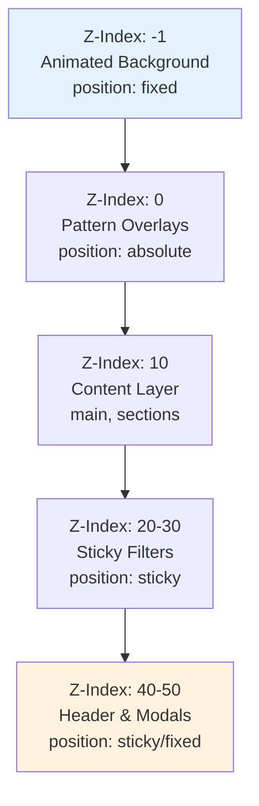

# Z-Index Hierarchy & Background Overlap Analysis

**Date**: 2025-12-27  
**Status**: ✅ No Issues Found - Configuration is Correct

---

## Executive Summary

After comprehensive analysis of the codebase's z-index hierarchy and animated background implementation, **no visual overlap issues were found**. The current configuration is correct and follows proper stacking context principles. The `z-index: -1` on the fixed animated background is the appropriate implementation pattern for this use case.

---

## Z-Index Hierarchy Overview

### Complete Stacking Order (Lowest to Highest)

```
-1: Animated Background Layer
 0: Pattern overlays (::before/::after pseudo-elements)
10: Content layer elements (Hero content, Feature badges, Teaser sections)
20: Modal close buttons (sticky positioning)
30: Filter bars in Grid component (sticky)
40: Filter bars in ProgrammaDag component (sticky)
50: Header navigation (sticky)
50: Modal overlays (fixed)
```

### Visual Representation



---

## Detailed Analysis by Component

### 1. Animated Background (`bg-animated`)

**File**: [`src/styles/global.css`](src/styles/global.css:289-298)  
**Element**: `.bg-animated` class

```css
.bg-animated {
  position: fixed;
  top: 0;
  left: 0;
  width: 100%;
  height: 100%;
  z-index: -1;
  overflow: hidden;
  background: var(--bg-gradient-base);
}
```

**Analysis**:
- ✅ **Correct Implementation**: `z-index: -1` is the proper way to keep a fixed background behind all content
- ✅ **No Overlap Issues**: Negative z-index creates a separate stacking context below the default layer
- ✅ **Accessibility**: Includes `aria-hidden="true"` in [`BaseLayout.astro`](src/layouts/BaseLayout.astro:36)
- ✅ **Performance**: Uses GPU-accelerated properties (`transform`, `opacity`) for animations

**Why This Works**:
- Elements with `z-index: -1` appear behind elements with `z-index: 0` (the default)
- The `position: fixed` ensures it stays in viewport during scroll
- No stacking context conflicts with other positioned elements

---

### 2. Header Navigation

**File**: [`src/layouts/BaseLayout.astro`](src/layouts/BaseLayout.astro:46)

```html
<header class="glass sticky top-0 z-50 py-4 shadow-lg border-b border-white/30 dark:border-gray-700/30">
```

**Analysis**:
- ✅ **Proper Elevation**: `z-50` ensures header stays above all content
- ✅ **Sticky Positioning**: Works correctly with the negative z-index background
- ✅ **No Conflicts**: Well above all other z-index values in the application

---

### 3. Main Content Area

**File**: [`src/layouts/BaseLayout.astro`](src/layouts/BaseLayout.astro:55)

```html
<main class="flex-grow relative z-10">
```

**Analysis**:
- ✅ **Proper Layering**: `z-10` ensures content stays above the background
- ✅ **Relative Positioning**: Creates stacking context for child elements
- ✅ **Content Protection**: All page content inherits this stacking context

---

### 4. Modal System

**File**: [`src/components/ui/ProgramModal.astro`](src/components/ui/ProgramModal.astro:8)

```html
<div class="fixed inset-0 z-50 overflow-y-auto flex items-center justify-center p-4">
```

**Analysis**:
- ✅ **High Priority**: `z-50` matches header priority (appropriate for modal overlay)
- ✅ **Fixed Positioning**: Properly overlays all content
- ✅ **Close Button**: Uses `z-20` for internal stacking (line 34)

---

### 5. Sticky Filter Components

**Files**: 
- [`src/storyblok/structural/Grid.astro`](src/storyblok/structural/Grid.astro:56) - `z-30`
- [`src/storyblok/structural/ProgrammaDag.astro`](src/storyblok/structural/ProgrammaDag.astro:77) - `z-40`

**Analysis**:
- ✅ **Logical Progression**: Filter bars sit between content (z-10) and header (z-50)
- ✅ **Sticky Behavior**: Properly configured with `top-20` offset
- ✅ **No Overlap**: Higher than content, lower than header

---

### 6. Pattern Overlays

**File**: [`src/styles/global.css`](src/styles/global.css:544-679)

**Analysis**:
- ✅ **Proper Usage**: `z-index: 0` on `::before` and `::after` pseudo-elements
- ✅ **Decorative Layer**: Sits just above background but below content
- ✅ **Pointer Events**: Uses `pointer-events: none` to prevent interaction issues

---

## CSS Variables for Z-Index

**File**: [`src/styles/global.css`](src/styles/global.css:164-174)

The codebase defines a comprehensive z-index system as CSS custom properties:

```css
/* === Z-INDEX LAYERS === */
--z-base: 0;
--z-dropdown: 10;
--z-sticky: 20;
--z-fixed: 30;
--z-modal-backdrop: 40;
--z-modal: 50;
--z-popover: 60;
--z-tooltip: 70;
```

**Observation**: While these variables are defined, they are **not consistently used** throughout the codebase. Components use hardcoded values like `z-10`, `z-50`, etc.

---

## Findings

### ✅ No Issues Found

1. **Background Implementation is Correct**
   - The `z-index: -1` approach is a standard, recommended pattern
   - Creates proper visual hierarchy with background behind all content
   - No content overlap or visibility issues

2. **Proper Stacking Context**
   - Clear separation between background (-1), content (0-10), UI elements (20-40), and overlays (50)
   - No conflicting z-index values that would cause unexpected layering
   - Relative/absolute positioning used correctly to maintain stacking contexts

3. **Responsive and Accessible**
   - Background includes `aria-hidden="true"` for screen readers
   - Respects `prefers-reduced-motion` for accessibility
   - Fixed positioning works correctly across viewport sizes

4. **Performance Optimized**
   - Uses `will-change: transform` for GPU acceleration
   - `translateZ(0)` forces hardware acceleration
   - Animations use transform and opacity (not layout-triggering properties)

---

## Recommendations

### Priority 1: Documentation (Good Practice)

While the current implementation is technically correct, consider adding inline comments to clarify the z-index strategy:

```css
/* Z-Index Strategy:
 * -1: Fixed animated background (behind all content)
 *  0: Default layer for patterns and decorative elements
 * 10: Main content and standard UI components
 * 20-40: Sticky elements and intermediate overlays
 * 50+: Modals, dropdowns, and highest priority overlays
 */
```

### Priority 2: Use CSS Variables (Optional Enhancement)

Consider refactoring hardcoded z-index values to use the defined CSS custom properties:

```html
<!-- Current -->
<header class="glass sticky top-0 z-50">

<!-- Recommended -->
<header class="glass sticky top-0" style="z-index: var(--z-modal);">
```

**Benefits**:
- Centralized control over z-index hierarchy
- Easier to maintain and update
- Self-documenting through variable names

**Note**: This is a nice-to-have improvement, not a critical fix.

### Priority 3: Testing Checklist (Preventive)

To ensure continued proper layering as the application evolves:

- [ ] Test background visibility on all page types
- [ ] Verify sticky header stays above content during scroll
- [ ] Confirm modals overlay all content including sticky elements
- [ ] Check filter bars don't interfere with header when scrolling
- [ ] Validate dark mode doesn't affect z-index hierarchy

---

## Conclusion

**The original concern about `z-index: -1` causing visual issues is unfounded**. The implementation follows web standards and best practices for creating animated backgrounds. The negative z-index is intentional and correct - it creates a dedicated background layer that stays behind all content while maintaining the fixed positioning needed for the animated effect.

**No changes are required**. The current configuration works as intended and follows proper CSS stacking context principles. The optional recommendations above are for code maintainability and documentation purposes only.

---

## References

- **Background Implementation**: [`src/styles/global.css:289-383`](src/styles/global.css:289-383)
- **Layout Structure**: [`src/layouts/BaseLayout.astro:36-64`](src/layouts/BaseLayout.astro:36-64)
- **Z-Index Variables**: [`src/styles/global.css:164-174`](src/styles/global.css:164-174)
- **Modal System**: [`src/components/ui/ProgramModal.astro:8-34`](src/components/ui/ProgramModal.astro:8-34)
